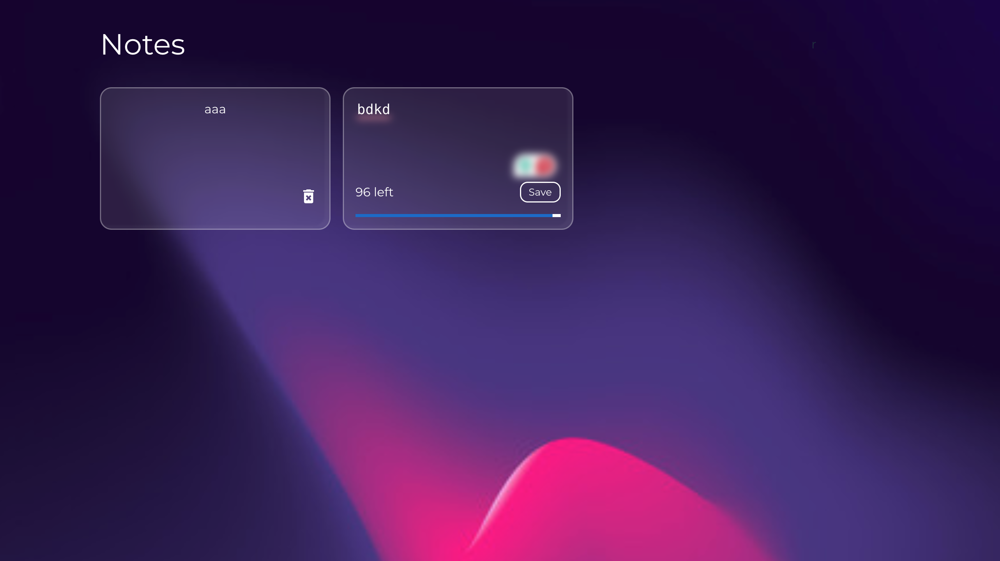
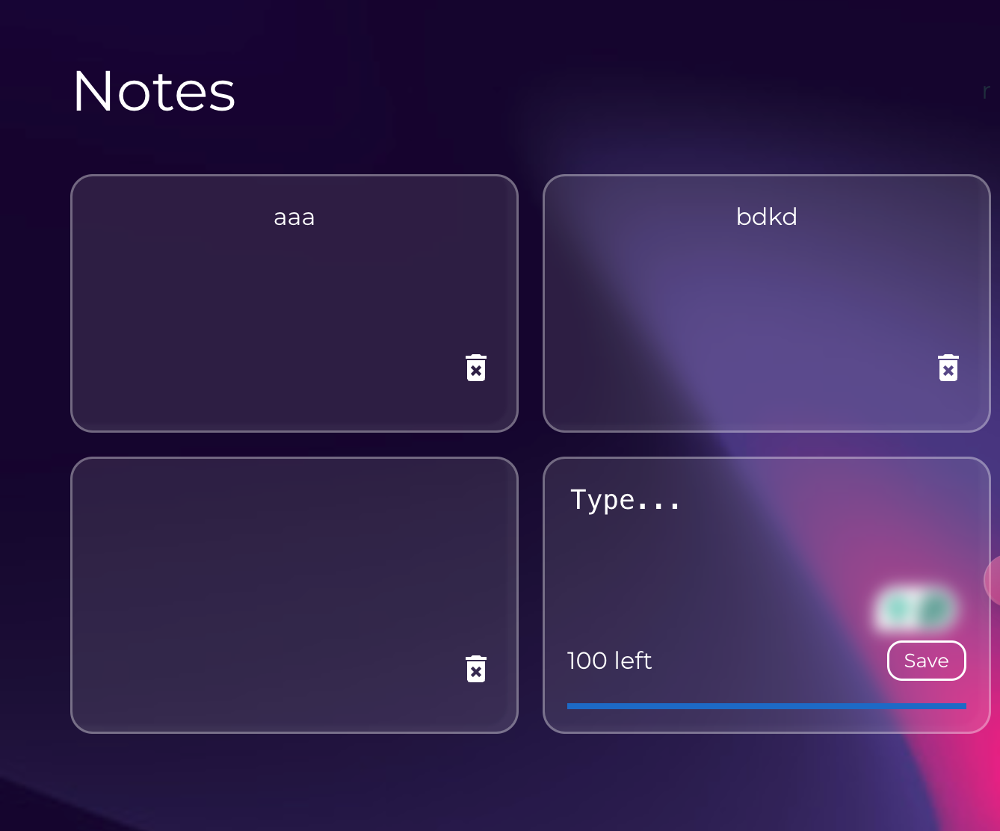
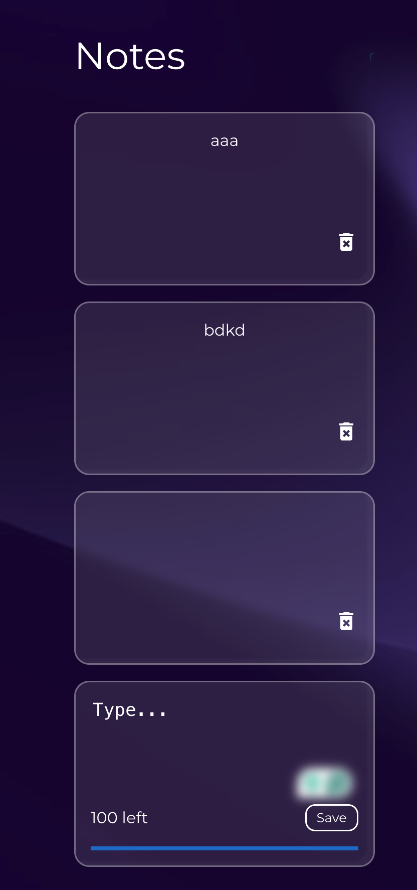

## Notes App.

### Tech stack

- React
- MUI
- TypeScript

### React

- useEffect
- useState
- props

### Others

- MUI
- localStorage
- uuid

### Install dependencies and dev dependency using

```bash
npm install
```

### Start the app locally using

```bash
npm run dev
```

### Screenshots






